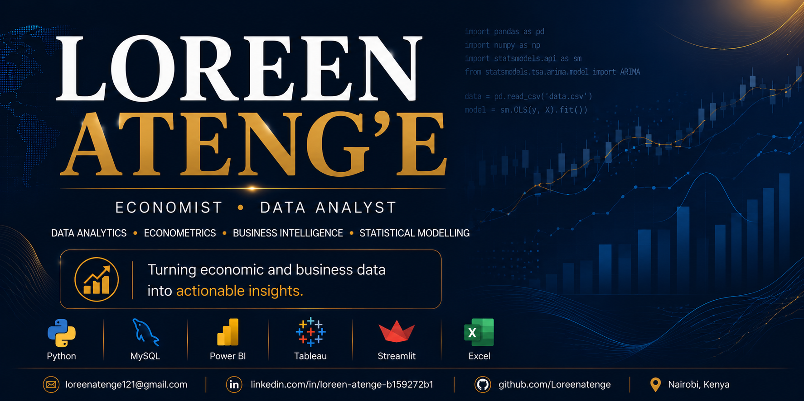

  

<h1 align="center">Hi , I'm Loreen Ateng'e</h1>

  

  <strong>Economics and Statistics Graduate • Data Analyst </strong>

Turning economic and business data into actionable insights.

---
#  Featured Projects

| Project | Description |
|---------|-------------|
| **[Kenya Inflation Drivers Analysis](https://github.com/Loreenatenge/kenya-inflation-analysis)** | Analysis of 44 years of Kenya's inflation data (1980–2024), identifying long-term inflation trends and structural changes using Python. |
| **[Kenya Debt Crisis Analysis](https://github.com/Loreenatenge/kenya-debt-crisis-analysis)** | Debt sustainability analysis using IMF indicators to assess Kenya's fiscal vulnerabilities. |
| **[Kenya Fiscal–Monetary Nexus](https://github.com/Loreenatenge/kenya-fiscal-monetary-nexus)** | Econometric investigation of the relationship between public debt and inflation using ARDL Bounds Testing. |

#  About Me

Economics & Statistics graduate from the **University of Nairobi** specializing in **data analytics, econometrics, macroeconomic research, and business intelligence**.

I enjoy applying Python, SQL, statistical modelling, and econometric techniques to transform economic and business data into actionable insights that support evidence-based policy, financial, and strategic decision-making.

My work focuses on:

- Data Analytics
- Econometrics
- Macroeconomic Analysis
- Fiscal & Monetary Policy
- Economic Forecasting
- Business Intelligence
- Interactive Dashboards

---

#  Tech Stack

---

#  Currently Learning

- Python for Data Anlytics
- Time Series Forecasting
- Advanced SQL
- Streamlit Dashboard Development
- Power BI & Tableau
- Advanced Excel

---

#  Career Goal

To bridge economics, statistics, and technology by building data-driven solutions that support policy analysis, financial decision-making, and business intelligence.

---

### *"Turning data into evidence, and evidence into better decisions."*

##  Let's Connect

I'm always interested in collaborating on projects involving economics, data analytics, econometrics, and business intelligence.

Feel free to connect with me on LinkedIn or reach out via email.
